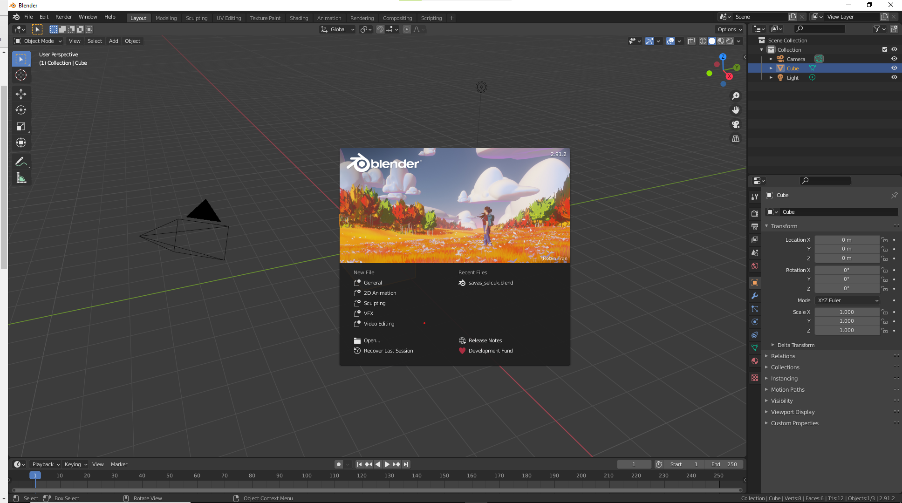

# Blender

Açık kaynak yazılım dünyasının biz kullanıcılara armağanıdır. Aşağıdaki ekran görüntüsü açılış ekranı olup bambaşka bir dünyaya adım atmanızı sağlayacaktır.

  

## Nedir ?  

Ücretsiz ve açık kaynaklı 3 Boyutlu tasarım oluşturma paketidir.

## Pakette ne var ?

Modelleme, donanım, animasyon, simülasyon, oluşturma, birleştirme ve canlandırma hatta video düzenleme gibi işlerinizi yapabileceğiniz bir programdır.

İleri düzey kullanıcıların uygulamayı özelleştirmesi Python programlama dili ile mümkündür. 

Çapraz platformdur Linux, Windows ve Macintosh bilgisayarlarda çalışır. Grafik ara yüzü olarak OpenGL kullanır.

GNU Genel Kamu Lisansı(GPL) kapsamında kullanıcı kod tabanında küçük büyük değişiklikler yapma hakkına sahiptir.

[Blender hakkında](https://www.blender.org/about/) daha çok bilgi ve kullanıcı deneyimlerine ulaşmak mümkün.